# Neuron_Simulation
OpenGL based Neuron Simulation with interactions between ions and Na+/K+ channels

## Synaptic signaling

<html>
<body>
    

        
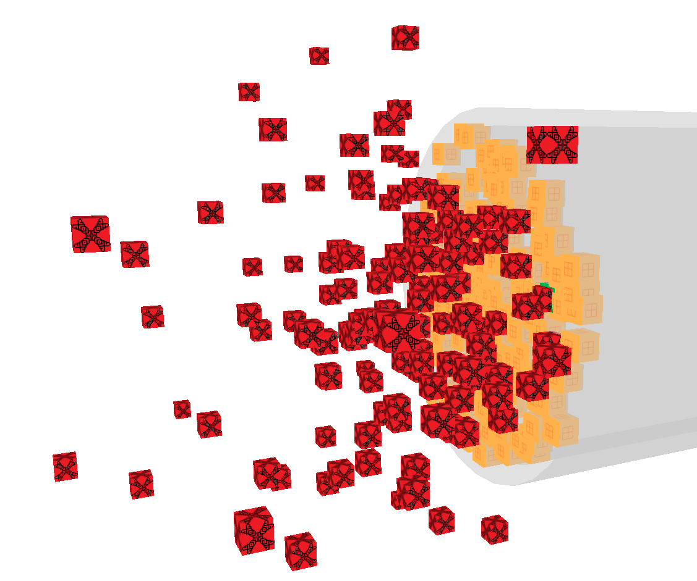

        
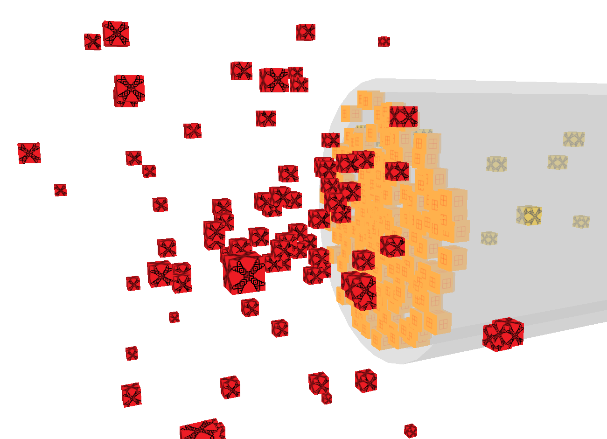

        
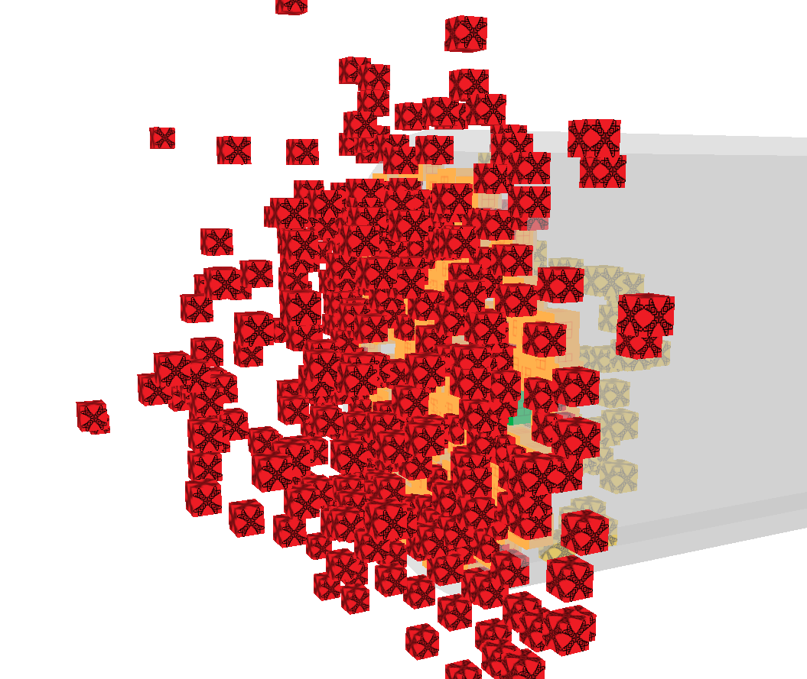

    

</body>
</html>

## Depolarization

<html>
<body>
    

        
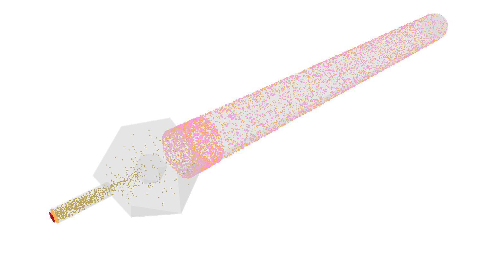

        
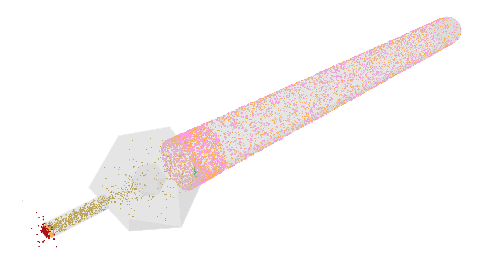

        
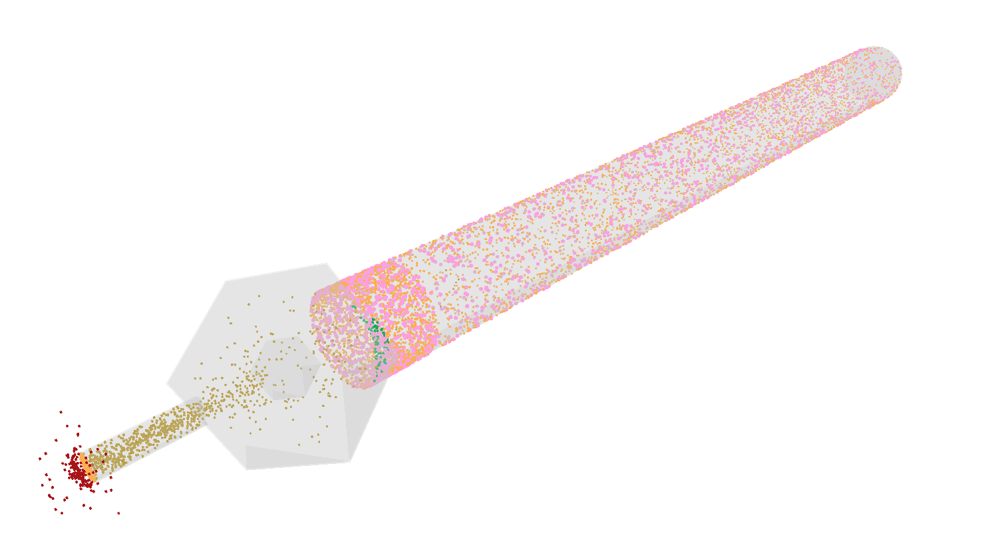

        
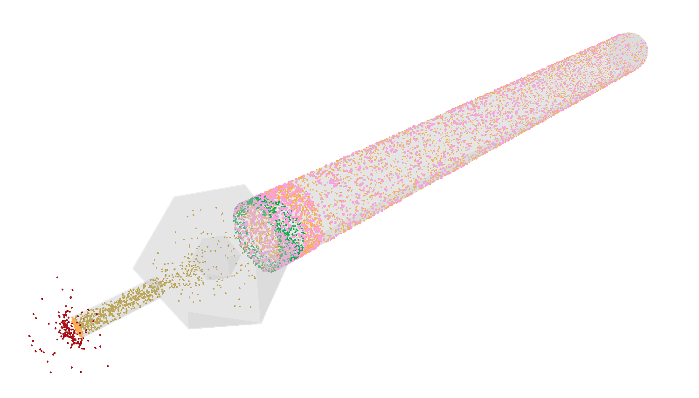

        
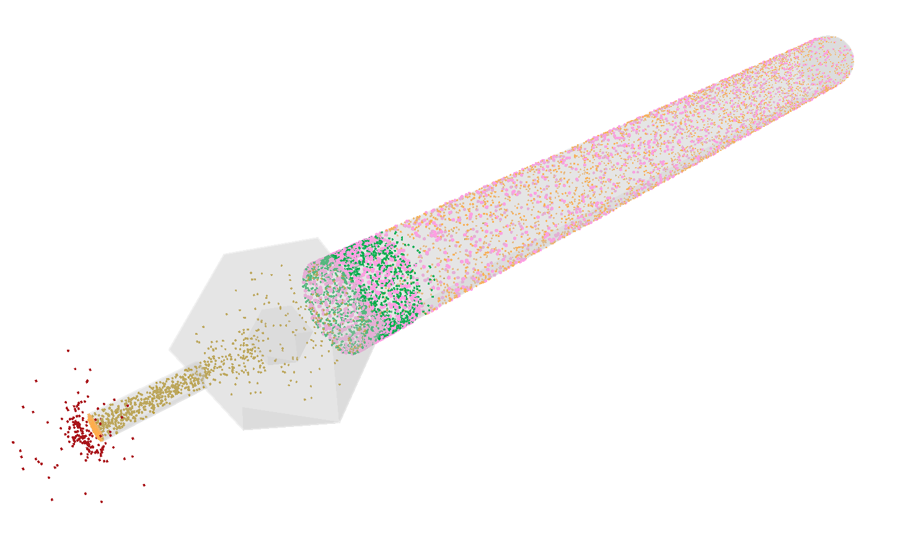

        
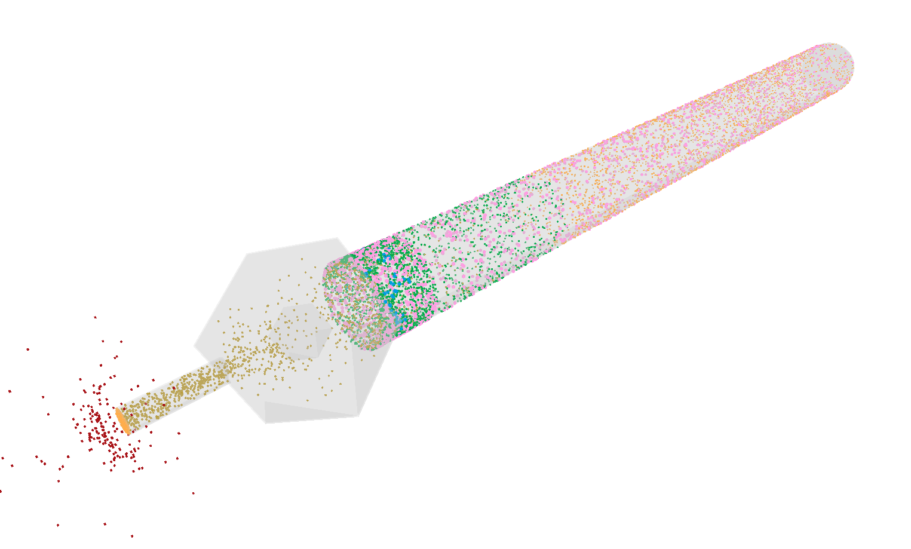

        
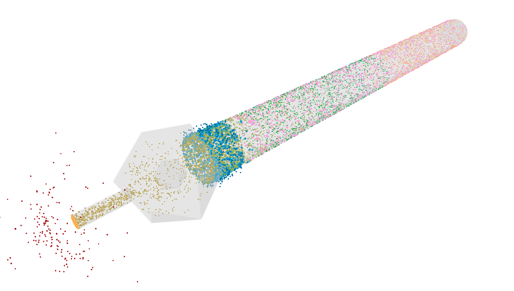

        
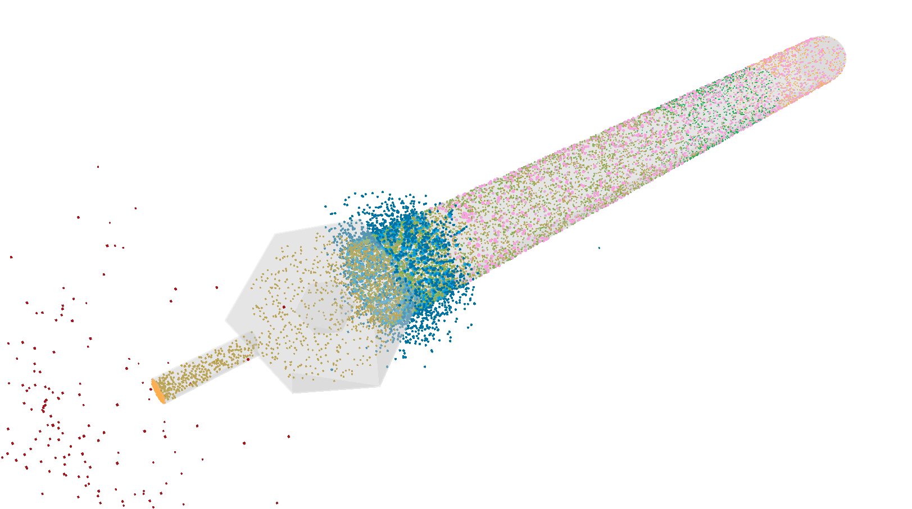

        
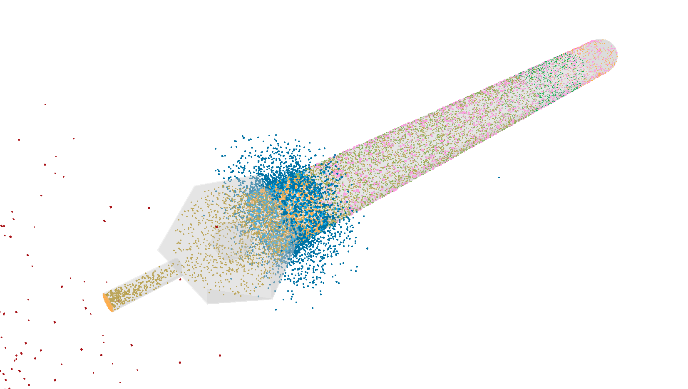

        

    

</body>
</html>

## Repolarization

<html>
<body>
    

        
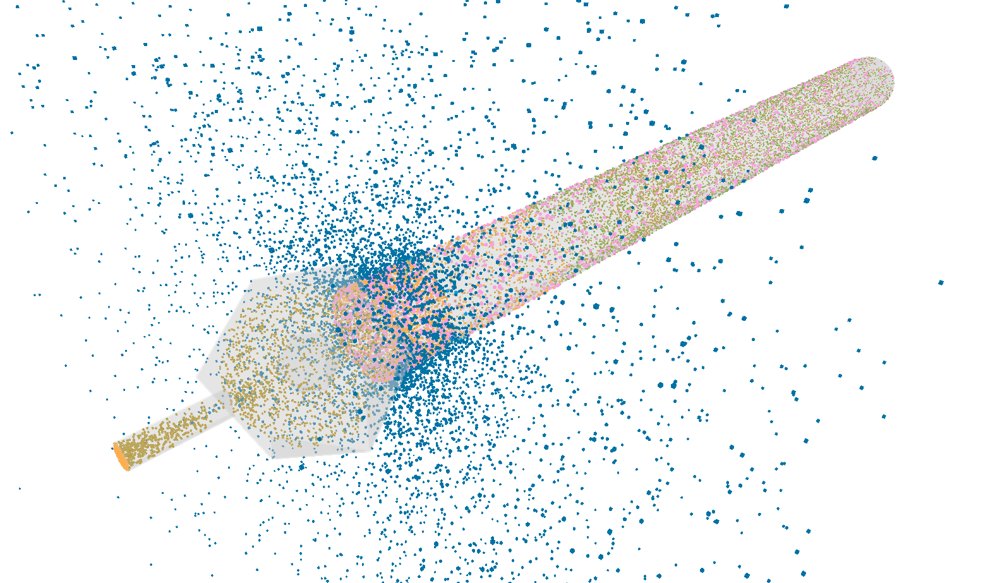

        
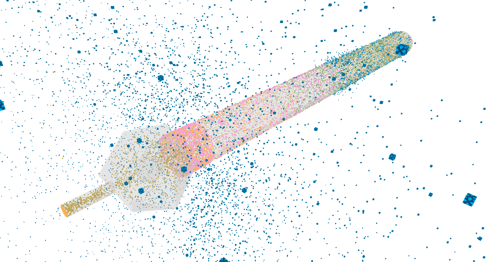

        
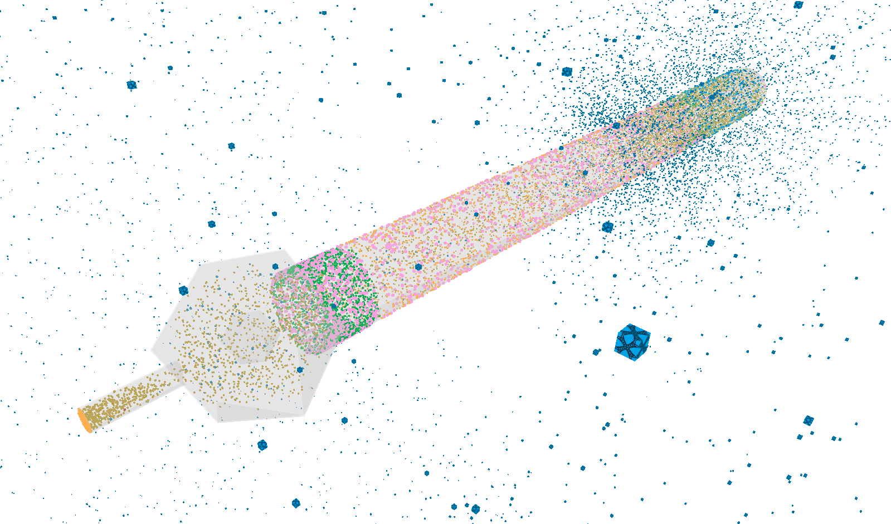

        
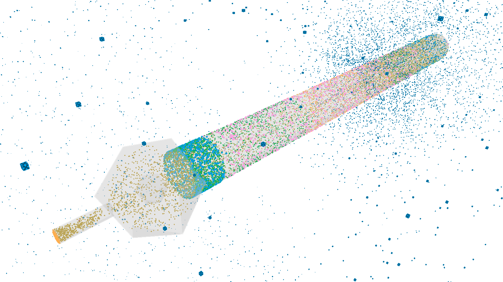

    

</body>
</html>

## Rest

<html>
<body>
    

        
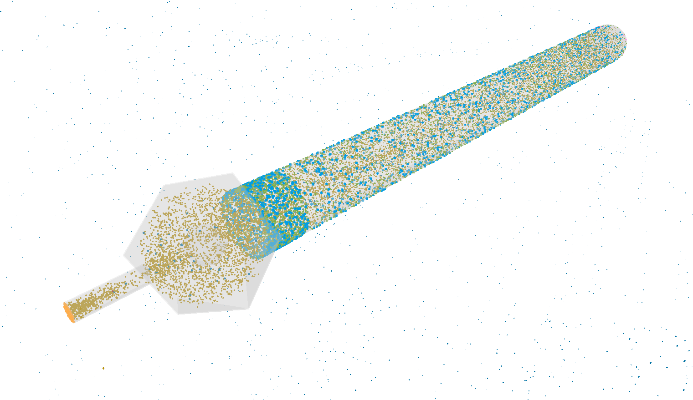

    

</body>
</html>
